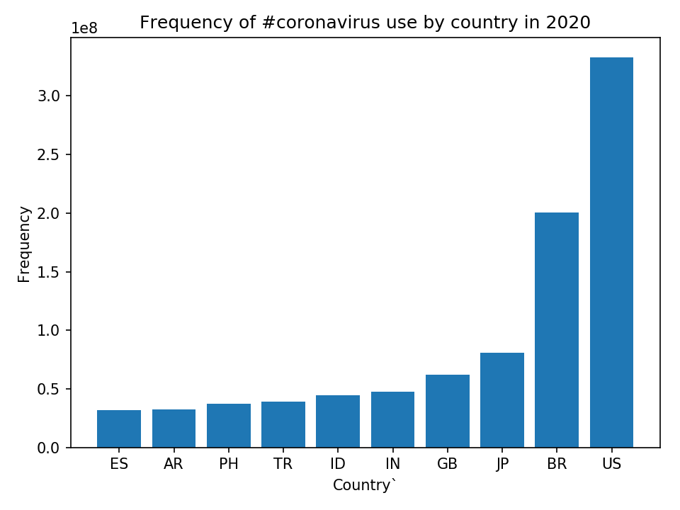
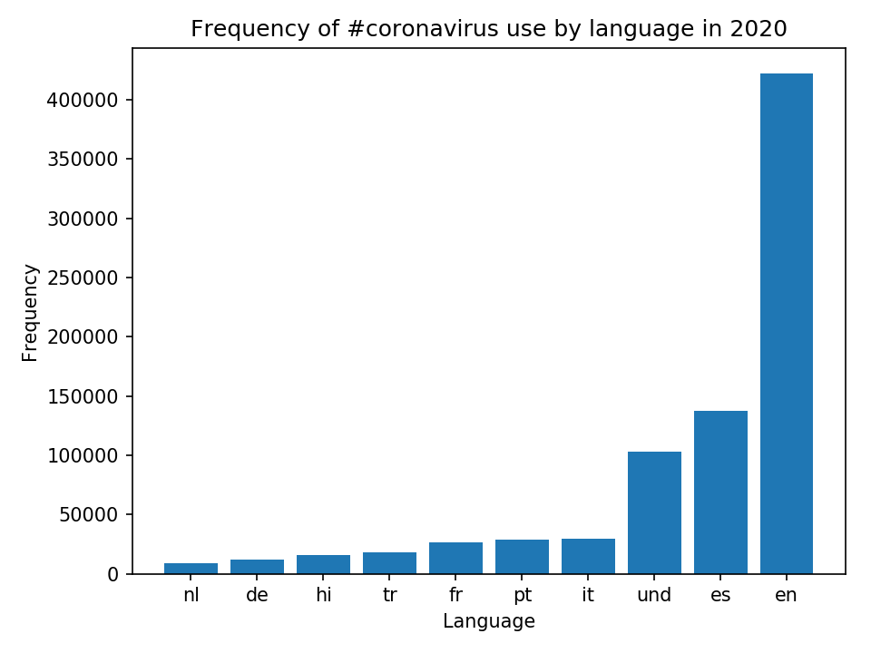
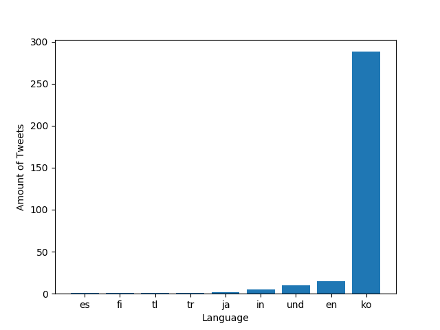
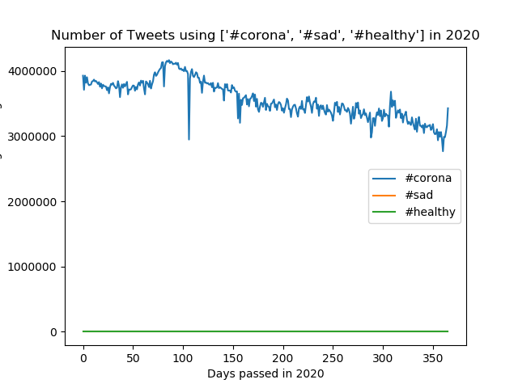

# Coronavirus twitter analysis

## Background

**About the Data:**

Approximately 500 million tweets are sent everyday.
Of those tweets, about 2% are *geotagged*.
That is, the user's device includes location information about where the tweets were sent from.
The lambda server's `/data/Twitter dataset` folder contains all geotagged tweets that were sent in 2020.
In total, there are about 1.1 billion tweets in this dataset.

The tweets are stored as follows.
The tweets for each day are stored in a zip file `geoTwitterYY-MM-DD.zip`,
and inside this zip file are 24 text files, one for each hour of the day.
Each text file contains a single tweet per line in JSON format.
JSON is a popular format for storing data that is closely related to python dictionaries.

**Description of the Data Analysis:**
The goal of this project is to analyze the goetagged tweets that were sent in 2002. 
Specifically, the hashtags I chose were used to gather a comaprison between the number of tweets that were used with one hashtag compared to others.
With the data provided and the functions used I created a visualization of the data through graphs.
Additionally, the alternative reduce functionw as used to analyze how many times the hashtags were used in the year of 2020.

## Results

**Task 3 graphs:**
The graphs below showcase the usage of a hashtagh, the first is provided by country and the second by language, respecitvely. The results show that '#coronavirus' is used most often in English and '#코로나바이러' in Korean.

**Task 4 graphs:**
The graph below shows a comparison between the hashtags sent on 2020 on Twitter.

